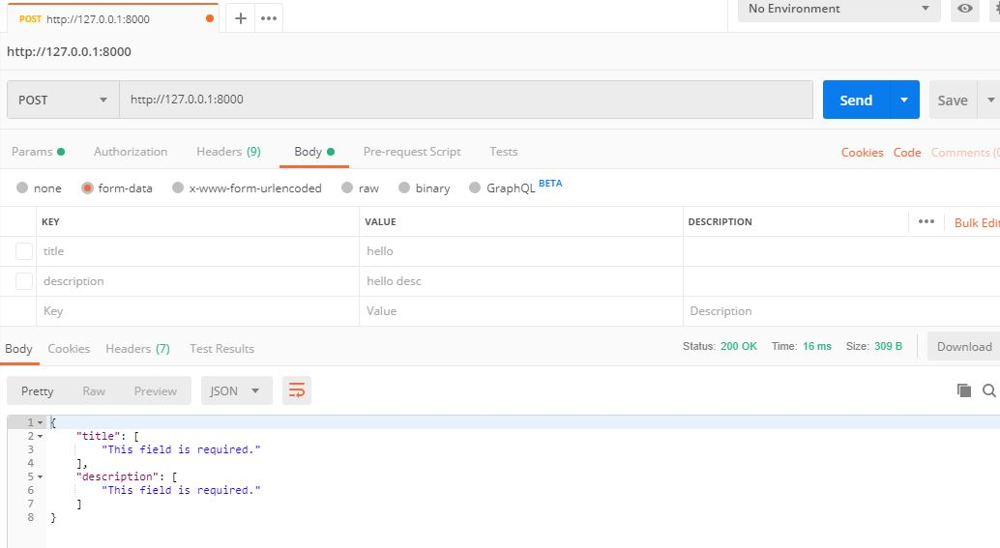

# Working with serializers

Typically we use django models to store in database. We must return the data in the database use DRF. We must convert data from models to json format. DRF uses serializers to do that. 

Serializers is a structure similar to a model or a form. It represents the data you want to return in json format or accept in json format. 

### Code:

- In core app create a file name ```serializers.py```
- In core app's model make a model.:

    ```python

    from django.db import models
    from django.contrib.auth import get_user_model


    class Post(models.Model):
        title = models.CharField(max_length=100)
        description = models.TextField()
        timestamp = models.DateTimeField(auto_now_add=True)
        owner models.ForeignKey(User, on_delete=models.CASCADE)

        def __str__(self):
            return self.title

    ```

### Post Requests:
- In serializers.py:
- We create serializer just like creating a form. 

    ```python
    
    from .models import Post

    from django import forms

    class postForm(forms.ModelForm):
        class Meta:
            model = Post
            fields = (
                'title','description'
            )

    ```

- Instead of forms we now use serializers as:

    ```python

    from rest_framework import serializers

    from .models import Post

    class PostSerializer(serializers.ModelSerializer):
        class Meta:
            model = Post
            fields = (
                'title','description'
            )

    ```
- PostSerializer represents transformation between post model into json payload that contains the specified fields: ``` 'title' and 'description' ```
- In the backend they will look at these fields and what kinds of fields they are and then serialize them according to their type. 
- We can now use the PostSerializer in our views. 

    ```python

    # Serializers contents:
    from .serializers import PostSerializer
    from .models import Post

    class TestView(APIView):
        def get ...

        def post(self, request, *args, **kwargs):
            serializer = PostSerializer(data = request.data)
            if serializer.is_valid():
                serializer.save()
                return Response(serializer.data)
            return Response(serializer.errors)    

    ```

- Using serializers in two ways: Post requests(recieve data) and get requests.
- In post requests we would recieve some data in that request and check if the data matches the format of the serializers.
- We are using PostSerializers, check if the request data is valid and pass that request. 
- From postman we tried sending variations of requests

**Sending Nothing:**
    

**Sending only title:**
    

**Sending both Title and Description:**
- We still get error because we have no user posting the data. 
    


### Get Requests:
- Register the model in app's admin.py
    ```python
    from .models import Post

    # Register your models here.
    admin.site.register(Post)
    ```
- Add create superuser and add two Post from admin.
- In views.py add the following:
    ```python
    def get(self, request, *args, **kwargs):
        qs = Post.objects.all()
        serializer = PostSerializer(qs, many=True)
        return Response(serializer.data)
    ```
- We have obtained the queryset. We have serialized the queryset data. We have used PostSerializer and since there are many data we pass many = True argument to it. 
- We have returned the serializer data. 
- Also we haven't used the is_valid() method because we are not passing the data. We are simply serializing the queryset of known model. 


- Get send a get request to a localhost and our json response is a list of dictionaries. The field of the dictionaries corresponds to what we have sent in a serializer. 
- Suppose we want to send the get owner too. We can change the serializer as follows:

    ```python
    class PostSerializer(serializers.ModelSerializer):
        class Meta:
            model = Post
            fields = (
                'title',
                'description',
                'owner'
            )
    ```
- We get the following response:


- 1 is returned in the owner because they are the primary key of the users. 
- Getting only one data (as dictionary)
    ```python
    def get(self, request, *args, **kwargs):
        qs = Post.objects.all()
        post = qs.first()
        # serializer = PostSerializer(qs, many=True)
        serializer = PostSerializer(post)
        return Response(serializer.data)
    ```


